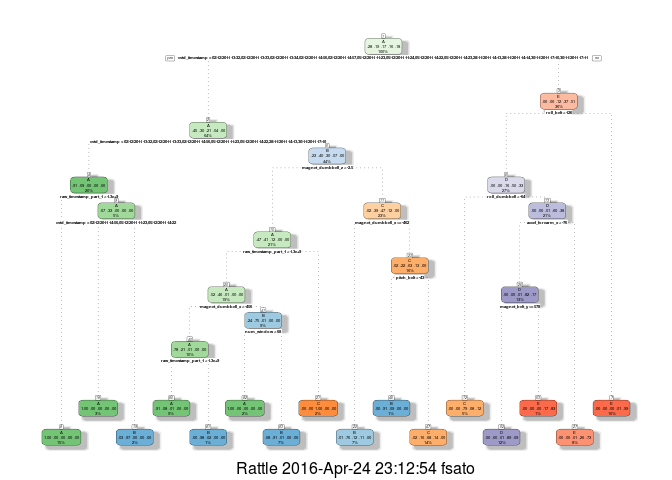
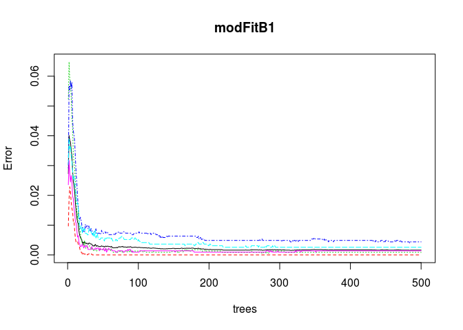

Summary
-------

Using devices such as Jawbone Up, Nike FuelBand, and Fitbit it is now
possible to collect a large amount of data about personal activity
relatively inexpensively. These type of devices are part of the
quantified self movement – a group of enthusiasts who take measurements
about themselves regularly to improve their health, to find patterns in
their behavior, or because they are tech geeks. One thing that people
regularly do is quantify how much of a particular activity they do, but
they rarely quantify how well they do it. In this project, the goal is
to use data from accelerometers on the belt, forearm, arm, and dumbell
of 6 participants and predict the manner in which they did the exercise.
They were asked to perform barbell lifts correctly and incorrectly in 5
different ways.

Loading necessary libraries
---------------------------

    library(caret)
    library(rpart)
    library(rpart.plot)
    library(RColorBrewer)
    library(rattle)
    library(randomForest)
    library(knitr)
    library(gbm)
    library(survival)
    library(splines)
    library(parallel)
    library(plyr)

Loading Data
------------

Loading the working data and the 20 test case.

    if (!file.exists("pml-training.csv")) {
      download.file("http://d396qusza40orc.cloudfront.net/predmachlearn/pml-training.csv", 
                    destfile = "pml-training.csv")
    }
    if (!file.exists("pml-testing.csv")) {
      download.file("http://d396qusza40orc.cloudfront.net/predmachlearn/pml-testing.csv", 
                    destfile = "pml-testing.csv")
    }

    training <- read.csv("pml-training.csv", sep = ",", na.strings = c("NA","#DIV/0!",""))
    testing <- read.csv("pml-testing.csv", sep = ",", na.strings = c("NA","#DIV/0!",""))

Cleaning and Preparing Data
---------------------------

Splitting the training and test data

    inTrain <- createDataPartition(training$classe, p = 0.6, list = FALSE)
    mytraining <- training[inTrain, ]
    mytesting <- training[-inTrain, ]

Removing variables with near zero variance

    nzv <- nearZeroVar(mytraining, saveMetrics = TRUE)
    mytraining <- mytraining[, nzv$nzv == FALSE]

    nzv <- nearZeroVar(mytesting, saveMetrics = TRUE)
    mytesting <- mytesting[, nzv$nzv == FALSE]

    mytraining <- mytraining[c(-1)]
    testing <- testing[-1,]

Removing variables that are almost NA's.

    trainingtemp <- mytraining
    for(i in 1:length(mytraining)) {
        if( sum( is.na( mytraining[, i] ) ) /nrow(mytraining) >= .7) {
            for(j in 1:length(trainingtemp)) {
                if( length( grep(names(mytraining[i]), names(trainingtemp)[j]) ) == 1)  {
                    trainingtemp <- trainingtemp[ , -j]
                }   
            } 
        }
    }

    mytraining <- trainingtemp
    rm(trainingtemp)

    header1 <- colnames(mytraining)
    header2 <- colnames(mytraining[, -58])
    mytesting <- mytesting[header1]
    testing <- testing[header2]   

Coercing testing data into the same type.

    for (i in 1:length(testing) ) {
        for(j in 1:length(mytraining)) {
            if( length( grep(names(mytraining[i]), names(testing)[j]) ) == 1)  {
                class(testing[j]) <- class(mytraining[i])
            }      
        }      
    }

    # To get the same class between testing and myTraining
    testing <- rbind(mytraining[2, -58] , testing)
    testing <- testing[-1,]

Prediction with Decision Trees
------------------------------

    set.seed(74810)
    modFitA1 <- rpart(classe ~ ., data = mytraining, method = "class")
    fancyRpartPlot(modFitA1)

<!-- -->

    predictionsA1 <- predict(modFitA1, mytesting, type = "class")
    cmtree <- confusionMatrix(predictionsA1, mytesting$classe)
    cmtree

    ## Confusion Matrix and Statistics
    ## 
    ##           Reference
    ## Prediction    A    B    C    D    E
    ##          A 2152   76    8    3    0
    ##          B   58 1248   79   59    0
    ##          C   22  178 1250  209   66
    ##          D    0   16   15  816   87
    ##          E    0    0   16  199 1289
    ## 
    ## Overall Statistics
    ##                                           
    ##                Accuracy : 0.8609          
    ##                  95% CI : (0.8531, 0.8685)
    ##     No Information Rate : 0.2845          
    ##     P-Value [Acc > NIR] : < 2.2e-16       
    ##                                           
    ##                   Kappa : 0.824           
    ##  Mcnemar's Test P-Value : NA              
    ## 
    ## Statistics by Class:
    ## 
    ##                      Class: A Class: B Class: C Class: D Class: E
    ## Sensitivity            0.9642   0.8221   0.9137   0.6345   0.8939
    ## Specificity            0.9845   0.9690   0.9267   0.9820   0.9664
    ## Pos Pred Value         0.9611   0.8643   0.7246   0.8737   0.8570
    ## Neg Pred Value         0.9857   0.9578   0.9807   0.9320   0.9759
    ## Prevalence             0.2845   0.1935   0.1744   0.1639   0.1838
    ## Detection Rate         0.2743   0.1591   0.1593   0.1040   0.1643
    ## Detection Prevalence   0.2854   0.1840   0.2199   0.1190   0.1917
    ## Balanced Accuracy      0.9743   0.8956   0.9202   0.8083   0.9302

Prediction with Random Forests
------------------------------

    set.seed(74810)
    modFitB1 <- randomForest(classe ~ ., data = mytraining)

    predictionB1 <- predict(modFitB1, mytesting, type = "class")
    cmrf <- confusionMatrix(predictionB1, mytesting$classe)
    cmrf

    ## Confusion Matrix and Statistics
    ## 
    ##           Reference
    ## Prediction    A    B    C    D    E
    ##          A 2232    1    0    0    0
    ##          B    0 1517    2    0    0
    ##          C    0    0 1365    3    0
    ##          D    0    0    1 1282    1
    ##          E    0    0    0    1 1441
    ## 
    ## Overall Statistics
    ##                                           
    ##                Accuracy : 0.9989          
    ##                  95% CI : (0.9978, 0.9995)
    ##     No Information Rate : 0.2845          
    ##     P-Value [Acc > NIR] : < 2.2e-16       
    ##                                           
    ##                   Kappa : 0.9985          
    ##  Mcnemar's Test P-Value : NA              
    ## 
    ## Statistics by Class:
    ## 
    ##                      Class: A Class: B Class: C Class: D Class: E
    ## Sensitivity            1.0000   0.9993   0.9978   0.9969   0.9993
    ## Specificity            0.9998   0.9997   0.9995   0.9997   0.9998
    ## Pos Pred Value         0.9996   0.9987   0.9978   0.9984   0.9993
    ## Neg Pred Value         1.0000   0.9998   0.9995   0.9994   0.9998
    ## Prevalence             0.2845   0.1935   0.1744   0.1639   0.1838
    ## Detection Rate         0.2845   0.1933   0.1740   0.1634   0.1837
    ## Detection Prevalence   0.2846   0.1936   0.1744   0.1637   0.1838
    ## Balanced Accuracy      0.9999   0.9995   0.9987   0.9983   0.9996

    plot(modFitB1)

<!-- -->

Prediction with Generalized Boosted Regression
----------------------------------------------

    set.seed(74810)
    fitControl <- trainControl(method = "repeatedcv", number = 5, repeats = 1)

    gbmFit1 <- train(classe ~ ., data = mytraining, method = "gbm", trControl = fitControl, verbose = FALSE)
    gbmFinMod1 <- gbmFit1$finalModel

    gbmPredTest <- predict(gbmFit1, newdata = mytesting)
    gbmAccuracyTest <- confusionMatrix(gbmPredTest, mytesting$classe)
    gbmAccuracyTest

    ## Confusion Matrix and Statistics
    ## 
    ##           Reference
    ## Prediction    A    B    C    D    E
    ##          A 2232    7    0    0    0
    ##          B    0 1500    1    0    0
    ##          C    0    4 1357    2    0
    ##          D    0    7   10 1281    5
    ##          E    0    0    0    3 1437
    ## 
    ## Overall Statistics
    ##                                           
    ##                Accuracy : 0.995           
    ##                  95% CI : (0.9932, 0.9965)
    ##     No Information Rate : 0.2845          
    ##     P-Value [Acc > NIR] : < 2.2e-16       
    ##                                           
    ##                   Kappa : 0.9937          
    ##  Mcnemar's Test P-Value : NA              
    ## 
    ## Statistics by Class:
    ## 
    ##                      Class: A Class: B Class: C Class: D Class: E
    ## Sensitivity            1.0000   0.9881   0.9920   0.9961   0.9965
    ## Specificity            0.9988   0.9998   0.9991   0.9966   0.9995
    ## Pos Pred Value         0.9969   0.9993   0.9956   0.9831   0.9979
    ## Neg Pred Value         1.0000   0.9972   0.9983   0.9992   0.9992
    ## Prevalence             0.2845   0.1935   0.1744   0.1639   0.1838
    ## Detection Rate         0.2845   0.1912   0.1730   0.1633   0.1832
    ## Detection Prevalence   0.2854   0.1913   0.1737   0.1661   0.1835
    ## Balanced Accuracy      0.9994   0.9940   0.9955   0.9964   0.9980

Predicting Results on the Test Data
-----------------------------------

Ramdom Forests gave an Accuracy of 99.71% so this model was used to
predict the 20 cases.

    predictionB2 <- predict(modFitB1, testing, type = "class")
    predictionB2

    ## 21  3  4  5  6  7  8  9 10 11 12 13 14 15 16 17 18 19 20 
    ##  A  B  A  A  E  D  B  A  A  B  C  B  A  E  E  A  B  B  B 
    ## Levels: A B C D E
